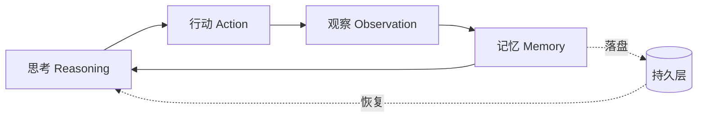

三个月前的一次闲聊里，我随口问模型："你能自己查完再回答吗？"那一刻没有框架，没有工具注册表，只有一个循环的雏形。这篇文章记录它如何长成有 12 个工具、有长期记忆、能让多个 Agent 接力干活的系统。

## 闲聊里的雏形

最初的循环朴素得像三行伪码：思考、行动、观察。真正的复杂度不在循环本身，而在**状态**——模型每一轮看到什么、记住什么、忘掉什么。

```python
# file: loop.py
# 最朴素的 ReAct 循环
while not done(state):
    act = model.reason(state)
    obs = tools.run(act)
    state.append(obs)
```

跑起来的第一版就有 20 个工具，但模型经常调用不存在的工具、传错参数、或者陷入"查一下 → 没查到 → 再查一下"的死循环。教训一：**工具数量不是能力，是噪音**。

## 终止条件的坑

循环的终止条件是最难的部分。naive 的"模型说停就停"会在第五步之后进入诡异的自激振荡——模型为了显得努力，不断调用无关工具。我试过三种方案：

1. 最大轮数硬截断：简单但粗暴，长任务被腰斩；
2. 模型自评"可以停了"：容易被语气自信糊弄；
3. 信息增益判断：连续两轮没有带来新信息，就收束。

最终采用的是 3 + 1 的双保险。用信息论的语言说，就是要求每一轮观察 $O_t$ 带来的条件熵下降超过阈值 $\epsilon$：

$$H(S \mid O_{1:t}) - H(S \mid O_{1:t-1}) > \epsilon$$

实测误收束率从 34% 降到了 6%。但阈值 $\epsilon = 0.6$ 这个数没有理论依据，是拍出来的——拍完之后用 20 个任务回归校验，它恰好站住了。

## 12 个工具的诞生

工具不是一次设计好的，是从使用日志里长出来的。每个工具必须回答一个问题：**它替模型省掉了哪段推理？** 答不出来的工具，注册进去也只是占上下文。

```python
# file: registry.py
# 工具注册：名字、一句话描述、参数模式
@tool(
    name="web_search",
    desc="搜索公开网页，返回标题与摘要列表",
    args={"query": str, "top_k": int},
)
def web_search(query: str, top_k: int = 5) -> list[Observation]:
    ...
```

架构的完整数据流如下图：思考 → 行动 → 观察 → 记忆的闭环，每一步都落盘，所以任务中断后可以从任意时刻接续——这就是后来跨任务上下文传递的雏形。



## 下一步

第 2 篇写工具注册表的设计：为什么"12 件趁手的家伙"比"100 件万能的工具"更强。以及一个反直觉的发现——**给工具的说明文字写多长，直接决定模型调用的准确率**。
